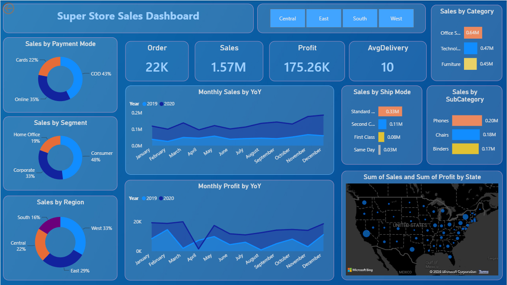
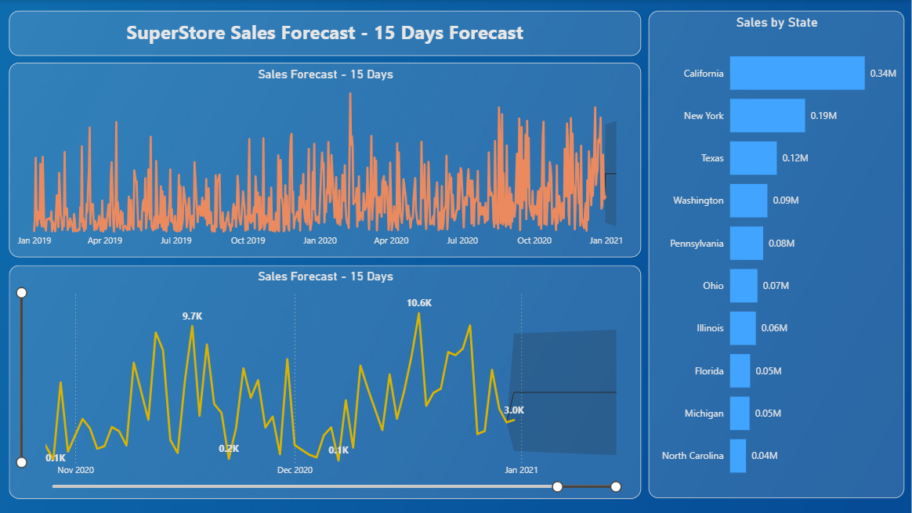

# 📊 SuperStore Sales Dashboard & Forecasting

An interactive Power BI dashboard built to analyze retail sales performance, profitability, and delivery efficiency — with time-series forecasting to project future sales trends.

---

## 🎯 Objective

To support data-driven business decision-making by analyzing retail sales data and applying time-series forecasting to predict future sales trends, while surfacing actionable insights across regions, categories, and delivery performance.

---

## 📈 Key Metrics

| KPI | Value |
|---|---|
| 🧾 Total Orders | 3,000+ |
| 💰 Total Sales | $1.56M+ |
| 📊 Profit Margin | 11.2% |
| 🚚 Avg Delivery Time | 3.9 days |
| 🌍 States Covered | 49 |
| 🗂️ Categories | 3 |
| 🔮 Forecast Horizon | 15 days |

---

## 🧩 Key Features

- **Interactive KPI Dashboard** — Sales, Profit, Order Count, and Average Delivery Days at a glance
- **Multi-level Filtering** — Slice and drill down by Region, Category, Sub-Category, Segment, and Payment Mode
- **Sales Forecasting** — 15-day sales forecast built on 2 years of historical order data using Power BI's time-series forecasting engine
- **YoY Trend Analysis** — Monthly sales and profit trends compared year-over-year to identify seasonal patterns
- **Geographic Insights** — Sales and profit distribution mapped across 49 U.S. states
- **Custom DAX Logic** — Purpose-built measures and calculated columns for sales aggregation and delivery-time analysis

---

## 🛠️ Tools & Technologies

| Tool | Purpose |
|---|---|
| **Power BI** | Dashboard design, visualization, forecasting |
| **DAX** | Custom measures and calculated columns |
| **Excel** | Source dataset |

---

## 📈 Dashboard Breakdown

**Page 1 — Sales Overview**
- Sales by Payment Mode, Segment, and Region (donut charts)
- Monthly Sales & Profit, Year-over-Year (trend lines)
- Sales by Category & Sub-Category
- Geographic sales/profit distribution by state

**Page 2 — Forecasting**
- 15-day sales forecast with confidence interval
- Sales by State (ranked bar chart)
- Historical sales trend line for context

---

## 🧮 DAX Measures & Calculated Columns

See [`dax-measures.md`](./dax-measures.md) for full DAX code, including:

- `Total Sales` — aggregated using `SUMMARIZE()` for forecasting
- `AvgDelivery` — calculated using `DATEDIFF()` for delivery-time KPIs

---

## 🗂️ Dataset

**SuperStore Sales Dataset** — 5,901 records across orders, shipping, customers, and product categories.

---

## 📁 Repository Structure
Superstore-Sales-Dashboard/
├── README.md
├── dax-measures.md
├── SuperStore_Dashboard.pbix
├── SuperStore Sales DataSet.xlsx
├── dashboard-overview.png
└── forecasting-page.png

---

## 🚀 How to View

1. Download `SuperStore_Dashboard.pbix`
2. Open in **Power BI Desktop** (free download from Microsoft)
3. Explore the Dashboard and Forecasting pages interactively

---

## 👤 Author

**Abdul Moiz**
Data Analyst | Power BI • SQL • Python
📧 moiz13072004@gmail.com
🔗 [LinkedIn](https://linkedin.com/in/amabdulmoiz) · [GitHub](https://github.com/AbdulMoiz56)
